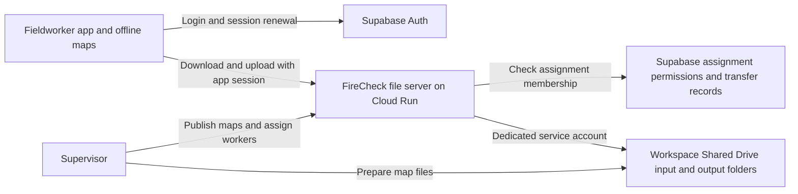

# FireCheck file server backed by Google Drive

Status: proposed architecture with storage and transfer scope confirmed by the user; no infrastructure provisioned.
Date: 2026-09-15

## Decision

Keep Google Drive as the file backend. Add one FireCheck file API between fieldworker phones and Drive. Keep Supabase Auth, assignment membership, survey synchronization, and local offline storage.

Fieldworkers authenticate to FireCheck once. Their app session authorizes downloads and uploads. Google login remains available for identity, but fieldworkers request no Drive scopes and hold no Drive tokens. The server accesses the confirmed Google Workspace Shared Drive with a dedicated service account. Both downloads and uploads are in scope.

This guarantees that the file-transfer code has no Google account picker or Drive consent step. It does not guarantee uninterrupted service, perpetual app sessions, or access after an administrator revokes assignment membership. Downloaded maps remain usable offline under the existing offline policy; remote revocation cannot instantly erase data from a disconnected phone.

## System diagram

## Responsibilities

| Component | Owns |
| --- | --- |
| Flutter app | Login, offline maps and forms, local pending transfers, progress, retries |
| Supabase Auth | User identity and app session renewal |
| Supabase Postgres | Assignment membership, supervisor roles, map versions, transfer state, audit records |
| File API on Google Cloud Run | Verify sessions and permissions; stream downloads; coordinate resumable uploads; access Drive |
| Google Drive | Source maps, published map files, completed exports and photos |
| Supervisor tools | Connect Drive, register folders, publish a version, assign workers, inspect failed transfers |
| Mapbox | Existing basemap and offline tile workflow; this proposal changes shapefile/file access, not Mapbox licensing or tokens |

Recommendation: one TypeScript service with a pinned supported Node.js runtime, deployed as a Cloud Run service. Cloud Run fits streamed downloads and bounded upload chunks. Start with one service and Postgres-backed transfer coordination; introduce a separate job worker only for measured publication/export workloads that exceed the request budget. Do not rely on work continuing after an HTTP response.

Supabase Edge Functions remain an alternative for small metadata endpoints, but adding a second API runtime initially is unnecessary. Their published memory/runtime limits warrant measurement before using them as the main file-transfer proxy. Cloud Run also has request limits: use streaming responses and bounded requests, not a whole ZIP buffered in memory. Hosting has a billing/operations cost; no deployment or expenditure is approved by this document.

## Confirmed Drive connection: Workspace Shared Drive

The user confirmed that maps are stored in a Google Workspace Shared Drive and that the server must handle both downloads and uploads. Use a dedicated service account; no supervisor OAuth refresh token is required for this design.

- Store the FireCheck folders in an organization-owned Shared Drive.
- Give a dedicated Drive service account the minimum permitted access to those folders/drive. Validate organization sharing restrictions and read/create/update permissions in a small integration spike.
- Cloud Run uses its runtime identity to impersonate that separate Drive account and mint short-lived OAuth access tokens with explicit Drive scopes through IAM Credentials. Restrict Token Creator permission to that target account. Do not assume a generic Cloud Run metadata token already has Drive scopes.
- No downloaded service-account key is needed. IAM permission and Drive file permission are separate and both must be configured.
- For the pilot, prove input read permission and output create/update permission separately. Scope write access operationally to the isolated FireCheck Drive connection. Never assume drive.file automatically exposes supervisor-created inputs.
- Tokens renew without a human login. Removing the service account from Drive or disabling it can still interrupt service; the supervisor resolves that centrally.

Do not use domain-wide delegation by default. It requires Workspace administrator involvement and grants a much broader trust relationship than this project needs.

## Access model: required before turning on the proxy

The server can see more files than an individual worker. Therefore Drive visibility cannot be the worker authorization rule anymore.

1. Supervisors explicitly enroll workers in `assignment_members` before download.
2. `GET /assignments` returns only that user's assignments with published maps.
3. Every manifest, file, upload-session, chunk, and completion request checks user identity and assignment permission. Derive worker identity from the verified session, never an email/user ID supplied by the phone.
4. Supervisor authority comes from a protected role/membership table, not editable user metadata. Start with explicitly bootstrapped supervisors; existing assignment `owner` is not automatically a global supervisor.
5. Assignment UUIDs are canonical. Folder names are display labels, never authority or identity. Drive file/folder IDs come from private server mappings. Clients cannot supply arbitrary Drive IDs, destination paths, or Google resumable URLs.
6. Preserve existing closed-assignment/submission rules. Separate read access from permission to create a new submission; explicitly define whether already-open uploads may finish after closure. Recommended: allow only a server-recorded accepted batch to complete, with all new batches rejected.

### Existing migration that must change

`supabase/migrations/033_claim_assignment_by_name.sql` currently lets any authenticated caller join a named assignment. The gateway must not trust memberships that can still be self-created that way. Revoke authenticated execution or replace the function with a permission-checked operation before gateway launch. Remove the client's auto-claim path in `assignment_name_resolver.dart`.

Audit existing memberships and have a supervisor confirm the roster; do not assume historical self-claims prove entitlement. Restrict the older name-resolution RPC as well. Existing mobile versions using auto-claim will need an explicit upgrade/migration path. Never temporarily open the gateway to all signed-in users to keep those old clients working.

## Authentication at the file API

- Require HTTPS and a Supabase access JWT on each worker request.
- Validate signature, expected project issuer, intended audience, expiration, and subject with supported JWT verification. Use project JWKS for asymmetric signing; if this project still uses legacy symmetric signing, use Supabase's authenticated user validation or plan key migration. Do not merely decode a JWT.
- Cloud Run's public endpoint may accept connections without Google IAM authentication so phones can send Supabase tokens; all application routes except a minimal health endpoint still require application authentication.
- Perform user-scoped membership reads through Supabase with the caller JWT and RLS. Server-owned writes use narrowly exposed operations after authorization; secrets that bypass RLS stay server-side.
- Check disabled-user/session state where prompt server-side revocation is required. JWT validation alone does not immediately revoke a previously issued token; document any chosen revocation window.
- On an expired app session, the app renews its Supabase session once and retries. If renewal is revoked, show the FireCheck login. This is distinct from Drive connection failure and never starts Drive consent.

## Map publishing and downloading

Supervisor workflow:

1. Continue placing source files under `firecheck/input/<assignment-name>/`.
2. Register the exact folder ID against the assignment UUID in FireCheck once. Do not search Drive globally for the first folder named `firecheck`.
3. Choose Publish in a small supervisor interface (an authenticated CLI is sufficient for the pilot).
4. The server validates component sets, filename collisions, sizes, coordinate metadata and required sidecars; copies the set into a version folder under `firecheck/published/<assignment-uuid>/<version>/`; computes a content manifest; publishes only after all files are ready.
5. Supervisor assigns workers. Preparing files in Drive alone does not publish them or grant access.

A map manifest contains opaque artifact IDs, allowed filenames, byte counts, content checksums, and required/optional status. Include `.shp`, `.shx`, `.dbf`, `.prj` and the existing form/requirements JSON/text sidecars as applicable. Reject shortcuts or resolve them only through explicit allowlisted registration. Snapshot source metadata before and after copying and reject a publication if its source changed mid-publish. Published folders are treated as immutable; verify content on download and report a changed release instead of importing mixed versions. Drive owners can still edit files, so naming a folder immutable is not sufficient protection by itself.

Worker workflow:

1. List authorized assignments and fetch the published manifest.
2. Preflight local space, including temporary download/import overhead.
3. Stream each artifact through the server into temporary local files, with bounded memory and progress.
4. Resume supported byte ranges against a pinned version; discard a partial download if the version/content identity changed.
5. Verify checksums and the existing shapefile validation rules.
6. Activate the completed import atomically using the existing import transaction/staging behavior, or extend it where needed. Preserve the previous usable map until replacement succeeds.
7. Continue the existing Mapbox offline tile step.

A sidecar-only change still creates a new manifest version; compare file hashes to download only changed artifacts. Folder modifiedTime is not a reliable version identifier. No signed Google download URL or Drive token is returned to the phone; bytes pass through the gateway.

## Uploads and photos

This is necessary for the end state of zero fieldworker Drive permissions. A downloads-only release still leaves the upload permission problem in place.

- Retain the local export and pending-upload queue. Keep files locally until a durable server completion receipt is received.
- Replace client-side root/folder discovery with a semantic API: assignment UUID, batch ID, filename, size and checksum. The server chooses the Drive destination and uploader identity.
- Store exports in `firecheck/output/<worker-label-and-id>/<assignment-name-and-id>/<batch-id>/`. Stable IDs avoid collisions; labels keep Drive understandable. Batch folders prevent concurrent workers or retries overwriting another submission. Supervisor export readers must be updated/tested for this layout.
- Create a batch with an idempotency key unique to the submitting user and assignment. File IDs/receipts and checksums are recorded per artifact.
- Persist Drive resumable-upload sessions server-side. The phone gets opaque FireCheck upload IDs only.
- Send bounded chunks (initial proposal: 8 MiB, a multiple of Drive's required 256 KiB unit except the last chunk). Server validates offsets/size and forwards chunks to Drive. Check confirmed upstream offset after uncertain responses; do not blindly append or restart.
- Serialize updates to an upload with a database lease/compare-and-swap so multiple Cloud Run instances or foreground/background workers cannot advance it concurrently. Expired leases recover after process crashes.
- Reconcile a crash after Drive commits but before Postgres records completion using a persisted target file ID and/or unique batch artifact metadata. Retrying completion must not create duplicate files or duplicate audit rows.
- Mark a batch complete only after all required files exist in Drive with matching sizes/checksums. Make `drive_uploads` completion/audit server-authored; clients must not be able to invent a completed Drive upload.
- Preserve the existing survey conflict/finalization flow. Database submission and Drive archival are separate states; expose “survey submitted, files pending” until the Drive batch is confirmed. Never claim a distributed atomic transaction across Supabase and Drive.

## Initial API contract

| Endpoint | Behavior |
| --- | --- |
| `GET /v1/assignments` | Paginated authorized assignment summaries, canonical IDs and published versions |
| `GET /v1/assignments/{id}/manifest` | Versioned file list, sizes and checksums |
| `GET /v1/assignments/{id}/versions/{version}/files/{artifact}` | Authenticated stream, Range support where valid, no arbitrary Drive locator |
| `POST /v1/assignments/{id}/uploads` | Authorize and create/reuse a batch from an idempotency key and manifest |
| `PUT /v1/uploads/{upload}/files/{artifact}/chunks` | Validate and proxy bounded bytes at a declared offset |
| `GET /v1/uploads/{upload}` | Confirmed offsets and completion receipts |
| `POST /v1/uploads/{upload}/complete` | Reconcile, verify completeness, record one durable completion |
| `POST /v1/admin/assignments/{id}/publish` | Validate and publish a prepared map version |
| `PUT /v1/admin/assignments/{id}/members/{user}` | Explicit supervisor-controlled enrollment |
| `GET /v1/admin/drive-connections/{id}/health` | Readability/writability/token status without exposing credentials |

Keep error codes stable: `SESSION_EXPIRED`, `ASSIGNMENT_FORBIDDEN`, `ASSIGNMENT_CLOSED`, `MAP_VERSION_CHANGED`, `DRIVE_CONNECTION_UNAVAILABLE`, `TRANSFER_OFFSET_MISMATCH`, `RATE_LIMITED`. A 401 means the worker session needs renewal; a supervisor Drive failure must not be represented as a worker 401. Retry transient failures with jitter and bounded exponential backoff, respecting Retry-After. Membership failures do not retry endlessly.

## Data additions (design only)

- Private `drive_connections`: service-account identity, approved shared-drive ID, root/input/output folder IDs, connection health. No human Google refresh token is stored.
- Protected assignment-to-connection/folder mapping, one active source per assignment initially.
- `map_versions` and private `map_artifacts`: version, status, manifest hash, Drive file IDs, filenames, sizes, checksums.
- `upload_batches` and `upload_artifacts`: authenticated uploader, assignment, idempotency key, declared/confirmed file data, Drive destination IDs, status, lease and receipts. Resumable URLs belong in server-only storage.
- Protected supervisor role grants, and reuse `assignment_members` for worker access.
- Existing `drive_uploads` becomes a server-confirmed audit projection; audit admin publications and membership changes as well.

Enable RLS on any exposed tables. Workers may read only their permitted records and may not write mappings, supervisor roles, memberships, release status or completion receipts directly. Do not expose Drive credentials/locations through a broad public view. Define retention for old releases, abandoned upload sessions, logs and audit records before production.

## Changes in this Flutter repository

- `lib/main.dart`: inject `GatewayMapSourceApi` and a gateway upload implementation; separate FireCheck identity from Google Drive token services.
- `lib/features/auth/data/google_sign_in_auth_repository.dart`: retain identity sign-in, remove Drive consent and token retrieval from the fieldworker login once both transfer paths migrate. The recent login-consent fix is transitional, not the gateway target.
- `lib/core/drive/drive_api.dart`: split map-read operations from the legacy `uploadAssignmentFiles` method; preserve the map-source abstraction and FTP behavior while explicitly replacing every Google upload caller.
- `lib/features/assignment/presentation/assignment_providers.dart`: retain discovery/progress/import states, consume gateway IDs and manifest versions.
- `lib/features/assignment/data/assignment_name_resolver.dart`: stop automatic membership claims; canonical ID comes from authorized server metadata.
- `lib/core/drive/drive_upload_worker.dart`: retain scheduling/progress responsibilities, replace Drive folder management with upload-batch/session requests.
- `lib/core/drive/drive_upload_api.dart`: replace raw Drive destination methods with semantic server upload operations; a one-for-one proxy of arbitrary folder methods would be unsafe.
- `lib/features/review/domain/execute_assignment_upload_use_case.dart`: preserve partial-upload confirmation and survey conflict handling, reconcile server archival receipts.
- Foreground/background bootstraps: renew app sessions, remove Google token-cache dependency after full cutover. Bind queued jobs to their original user; signing in as someone else must never upload the previous user's queue as the new user.
- UI: distinguish expired app login, lost assignment access and server Drive trouble. The latter tells workers to retry/contact the supervisor, with no Google picker.

## Rollout

1. **Integration spike:** record the Shared Drive and input/output folder IDs; prove server read + create + interrupted/resumed upload with the dedicated service account. Inventory largest map/file sizes, worker count, daily transfer bytes, and current supervisor output readers. No architecture choice is complete until the upload ownership test passes.
2. **Permissions first:** protected supervisor operations, verified membership roster, canonical folder registration, remove self-claim loophole. Plan the old-app cutoff with supervisors.
3. **Download pilot:** manifest publisher and gateway map source for a test assignment. Test on Android including force-stop, restart, expired app session, interrupted network, sidecar changes and an unauthorized worker. Keep existing maps intact.
4. **Upload pilot:** batch/chunk/receipt APIs and foreground/background queue migration. Test process termination and duplicate retries. Until this phase, describe the pilot as removing download consent only.
5. **Cutover:** supervisor confirms maps/rosters/exports; deploy the updated app; remove fieldworker Drive scopes/tokens; stop direct Drive fallback. Do not release the earlier Drive-consent-at-login approach as the final gateway login flow.
6. **Operations:** monitor connection health, upstream quota/errors, request latency, transfer failures and cost. Alert supervisors on meaningful server connection failures. Roll back server/mobile versions coherently; do not restore permissive membership claims as a rollback shortcut.

## Acceptance criteria

- A worker grants no Drive scope during login, map download, or survey/photo upload.
- Login, process restart and normal access-token expiry do not open Google UI from file transfer code.
- A worker with no membership cannot list, fetch or upload assignment artifacts, including by guessing IDs; cannot join by calling legacy RPCs.
- Revoking worker membership blocks subsequent online requests; offline behavior is explicitly documented.
- Changing the supervisor Drive connection affects no worker account selection; workers receive a service-status error and supervisors can repair it centrally.
- Interrupted downloads cannot activate partial/mixed shapefiles. Published sidecar changes are detected.
- Concurrent and repeated uploads do not overwrite another worker or produce duplicate completed submissions.
- Worker sign-out/account switch does not misattribute queued transfers.
- Large files stay within memory/request budgets; Drive quota errors trigger bounded retries, not synchronized retry storms.
- Database submission completion and file archival completion remain distinguishable and recover after crashes between them.

## Cost and scope

Drive still stores permanent files, but all phone transfer bytes now cross the server. Budget for Cloud Run compute/network transfer, Postgres transfer metadata, Google API quotas and supervisor connection upkeep. Do not assume a free tier will cover the workload. Establish concrete load assumptions before estimating a monthly amount. Add shared caching or a separate durable staging store only if measurements justify the extra storage and consistency complexity.

First production scope: one FireCheck organization, one approved Drive connection, explicit assignment roster. Multi-organization routing, automatic Drive group-permission mirroring, and a general-purpose Drive file browser are deferred.

## Sources verified during design

- [Google Drive shared drives and service-account ownership limits](https://developers.google.com/workspace/drive/api/guides/about-shareddrives)
- [Creating Drive folders; service accounts and My Drive uploads](https://developers.google.com/workspace/drive/api/guides/folder)
- [IAM short-lived service-account credentials](https://docs.cloud.google.com/iam/docs/create-short-lived-credentials-direct)
- [Drive resumable upload protocol](https://developers.google.com/workspace/drive/api/guides/manage-uploads)
- [Supabase JWT verification](https://supabase.com/docs/guides/auth/jwts)
- [Cloud Run request and streaming limits](https://docs.cloud.google.com/run/quotas)
- [Supabase Edge Functions limits](https://supabase.com/docs/guides/functions/limits)
- [Google OAuth refresh-token revocation handling](https://developers.google.com/identity/protocols/oauth2/resources/best-practices)

Validation: design traced against local auth, map-source, assignment membership, upload worker and review orchestration code. Diagram passed the Mermaid skill's static validator, which is not a browser-rendering test. Infrastructure, credentials and real-device transfers have not been tested as part of this architecture task.

## Confirmed choices and remaining implementation inputs

Confirmed: Google Workspace Shared Drive; both map downloads and completed survey/photo uploads; retain Google Drive as permanent file storage and Supabase as identity/permission metadata.

Before implementation, identify the Google Cloud project and hosting region, Shared Drive and source/destination folder IDs, the administrators who can grant service-account access, the initial supervisor/worker roster, and representative maximum map/photo/export sizes. These are configuration and sizing inputs; they do not change the selected architecture. A small authenticated supervisor CLI can support the pilot, followed by a supervisor screen for publishing maps and editing assignment rosters.
